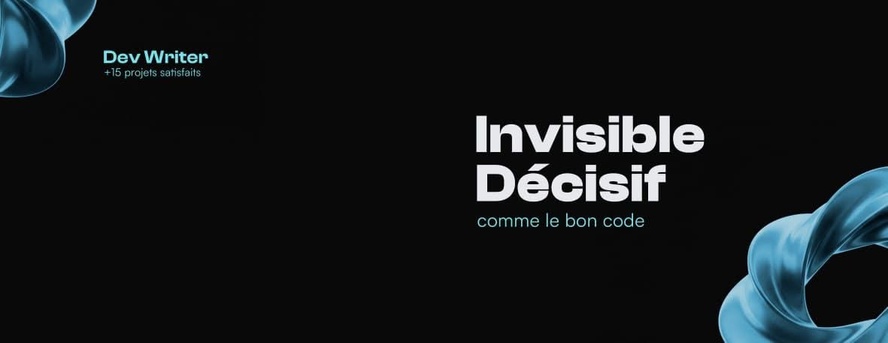

  

  
  
  

  
  
  
  

# Marie-Otniel HOUEDOTE

## Je construis ce qui rend les idées plus claires.

Je suis **développeur web et Dev Writer** : je transforme des problèmes complexes en produits lisibles, des interfaces utiles et des récits techniques qui donnent envie d’avancer. Entre code, IA et écriture, je travaille sur ce qui se voit — et surtout sur ce qui rend une expérience évidente.

> **Invisible décisif.** Une bonne structure enlève un doute. Une bonne interface raccourcit une décision. Un bon texte permet enfin au produit d’être compris.

---

## Ce que je construis

| Axe | Mon approche |
|---|---|
| **Produits web** | Des interfaces rapides, lisibles et pensées autour d’un vrai besoin. |
| **IA appliquée** | Des usages concrets qui augmentent la réflexion au lieu de remplacer le jugement. |
| **Récits techniques** | Des textes, documentations et explications qui donnent envie de comprendre. |

## Technologies que j’utilise pour donner forme aux idées

  

### Interfaces & expérience

  
  
  
  
  

### Données & services web

  
  
  
  

### IA, contenu & automatisation

  
  
  
  

### Outils de construction

  
  
  
  

Je m’intéresse particulièrement à la rencontre entre **expérience utilisateur**, **identité numérique**, **automatisation** et **rédaction technique**.

## Projets phares

Des produits livrés, pas seulement des maquettes. Chaque projet ci-dessous montre une manière différente de transformer une intention en expérience numérique.

### Cowri — Identité financière

**Fintech SaaS · Produit · IA**

Une application conçue pour aider les petits commerçants et utilisateurs à suivre, comprendre et piloter leur activité financière au quotidien.

`React` `TypeScript` `Node.js` `PostgreSQL` `Tailwind`

[Voir la démo →](https://cowrii.onrender.com) · [Explorer le dépôt →](https://github.com/Marie-Otniel/cowriidentite)

### APDD Event — Félicien Houngnibo

**Portfolio premium · Direction artistique · Motion**

Un portfolio pensé pour mettre en scène le travail d’un brand designer et photographe sans laisser l’interface voler la vedette au contenu.

`React` `TypeScript` `Tailwind` `Framer Motion`

[Voir la démo →](https://elite-visual-showcase.lovable.app/) · [Explorer le dépôt →](https://github.com/Marie-Otniel/elite-visual-showcase)

### Cave du Nord

**Restaurant · Bar · Lounge · Réservation**

Une présence digitale sombre et élégante qui réunit menu, galerie, ambiance de marque et parcours de réservation.

`React` `Tailwind` `Vercel` `i18n`

[Voir la démo →](https://cavedunord.vercel.app/) · [Explorer le dépôt →](https://github.com/Marie-Otniel/cavefu)

### Fleurielle — Copywriter

**Positionnement · Copywriting · Conversion**

Un site personnel qui transforme une expertise en message clair, portfolio lisible et parcours de conversion cohérent.

`React` `TypeScript` `Tailwind` `Vercel`

[Voir la démo →](https://fleurielle.vercel.app/) · [Explorer le dépôt →](https://github.com/Marie-Otniel/fleurielle-s-enchanted-words)

### Éclat Couture

**E-commerce · Mode · Storytelling**

Une vitrine digitale raffinée qui fait passer une maison de couture de la collection racontée à l’expérience d’achat.

`React` `TypeScript` `Tailwind` `Framer Motion`

[Voir la démo →](https://eclatcouture.lovable.app/) · [Explorer le dépôt →](https://github.com/Marie-Otniel/eclatcouture)

[Voir tous mes dépôts →](https://github.com/Marie-Otniel?tab=repositories) · [Voir le portfolio complet →](https://marieotniel.lovable.app)

## Comment je travaille

Je ne commence pas par choisir une technologie. Je commence par chercher ce qui doit devenir plus clair.

**01 — Observer.** Comprendre le contexte, la personne et le problème réel derrière la demande.

**02 — Clarifier.** Réduire le bruit, organiser l’information et définir ce qui mérite vraiment d’être construit.

**03 — Construire.** Transformer l’intention en une expérience qui fonctionne, qui se lit et qui peut évoluer.

**04 — Transmettre.** Documenter les choix et raconter le produit pour que sa valeur ne reste pas invisible.

## En ce moment

Je construis des expériences où **l’IA reste utile, le produit reste humain et le message reste clair**. Mes explorations actuelles portent sur les assistants intelligents, les SaaS à taille humaine, les interfaces qui expliquent au lieu de distraire et les formats de rédaction qui aident à mieux penser avant de mieux coder.

[Visiter mon espace Dev Writer →](https://dev-writer-core.vercel.app/) · [Découvrir mon portfolio →](https://marieotniel.lovable.app)

## Signaux de progression

Les chiffres ne racontent pas tout, mais ils montrent les terrains où je construis le plus : activité, commits et langages utilisés.

  
  

  

  

  

## Une collaboration commence souvent par une phrase

Vous avez une idée encore floue, un produit à clarifier ou un sujet technique à rendre accessible ? Je peux vous aider à passer de l’intention à une expérience claire, crédible et prête à être utilisée.

[Parlons de votre projet sur LinkedIn →](https://www.linkedin.com/in/marie-otniel-houedote) · [M’écrire par email →](mailto:houedotemarieotniel@gmail.com) · [Discuter sur WhatsApp →](https://wa.me/2290147812776?text=Bonjour%20Marie-Otniel%2C%20je%20viens%20de%20d%C3%A9couvrir%20votre%20profil%20GitHub%20et%20j%27aimerais%20discuter%20d%27un%20projet.)

  

  <em>Construire clairement. Écrire utilement. Décider avec intention.</em>

  Parakou, Bénin · Disponible pour des projets qui ont quelque chose à dire.

